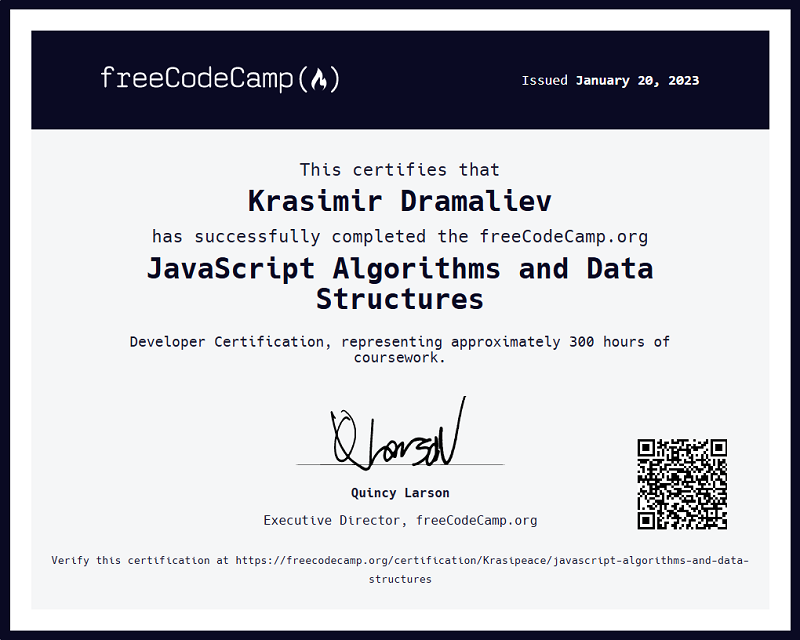

# [JavaScript Algorithms and Data Structures](https://www.freecodecamp.org/learn/javascript-algorithms-and-data-structures/) 

While HTML and CSS control the content and styling of a page, JavaScript is used to make it interactive. In the JavaScript Algorithm and Data Structures Certification, you'll learn the fundamentals of JavaScript including variables, arrays, objects, loops, and functions.

Once you have the fundamentals down, you'll apply that knowledge by creating algorithms to manipulate strings, factorialize numbers, and even calculate the orbit of the International Space Station.

Along the way, you'll also learn two important programming styles or paradigms: Object Oriented Programming (OOP) and Functional Programming (FP).

#### Courses:
[Basic JavaScript][1] 
[ES6][2] 
[Regular Expressions][3] 
[Debugging][4] 
[Basic Data Structures][5] 
[Basic Algorithm Scripting][6] 
[Object Oriented Programming][7] 
[Functional Programming][8] 
[Intermediate Algorithm Scripting][9] 

#### Projects:
|  | Name | Preview |
| ---: | :--- | :---: |
| 1    | [Palindrome Checker][10]      | [demo][15] |
| 2    | [Roman Numeral Converter][11] | [demo][16] |
| 3    | [Caesars Cipher][12]          | [demo][17] |
| 4    | [Telephone Number Validator][13] | [demo][18] |
| 5    | [Cash Register][14]           |  |

[1]: https://github.com/Krasipeace/JavaScript-Algorithms-and-Data-Structures---freecodecamp.org/blob/main/Basic%20JavaScript/readme.md
[2]: https://github.com/Krasipeace/JavaScript-Algorithms-and-Data-Structures---freecodecamp.org/blob/main/ES6/readme.md
[3]: https://github.com/Krasipeace/JavaScript-Algorithms-and-Data-Structures---freecodecamp.org/blob/main/Regular%20Expressions/readme.md
[4]: https://github.com/Krasipeace/JavaScript-Algorithms-and-Data-Structures---freecodecamp.org/blob/main/Debugging/readme.md
[5]: https://github.com/Krasipeace/JavaScript-Algorithms-and-Data-Structures---freecodecamp.org/blob/main/Basic%20Data%20Structures/readme.md
[6]: https://github.com/Krasipeace/JavaScript-Algorithms-and-Data-Structures---freecodecamp.org/blob/main/Basic%20Algorithm%20Scripting/readme.md
[7]: https://github.com/Krasipeace/JavaScript-Algorithms-and-Data-Structures---freecodecamp.org/blob/main/Object-Oriented%20Programming/readme.md
[8]: https://github.com/Krasipeace/JavaScript-Algorithms-and-Data-Structures---freecodecamp.org/blob/main/Functional%20Programming/readme.md
[9]: https://github.com/Krasipeace/JavaScript-Algorithms-and-Data-Structures---freecodecamp.org/blob/main/Intermediate%20Algorithm%20Scripting/readme.md

[10]: https://github.com/Krasipeace/JavaScript-Algorithms-and-Data-Structures---freecodecamp.org/tree/main/Projects/Palindrome%20Checker
[11]: https://github.com/Krasipeace/JavaScript-Algorithms-and-Data-Structures---freecodecamp.org/tree/main/Projects/Roman%20Numeral%20Converter
[12]: https://github.com/Krasipeace/JavaScript-Algorithms-and-Data-Structures---freecodecamp.org/tree/main/Projects/Caesars%20Cipher
[13]: https://github.com/Krasipeace/JavaScript-Algorithms-and-Data-Structures---freecodecamp.org/tree/main/Projects/Telephone%20Number%20Validator
[14]: https://github.com/Krasipeace/JavaScript-Algorithms-and-Data-Structures---freecodecamp.org/tree/main/Projects/Cash%20Register

[15]: https://htmlpreview.github.io/?https://github.com/Krasipeace/JavaScript-Algorithms-and-Data-Structures---freecodecamp.org/blob/main/Projects/Palindrome%20Checker/index.html
[16]: https://htmlpreview.github.io/?https://github.com/Krasipeace/JavaScript-Algorithms-and-Data-Structures---freecodecamp.org/blob/main/Projects/Roman%20Numeral%20Converter/index.html
[17]: https://htmlpreview.github.io/?https://github.com/Krasipeace/JavaScript-Algorithms-and-Data-Structures---freecodecamp.org/blob/main/Projects/Caesars%20Cipher/index.html
[18]:  https://htmlpreview.github.io/?https://github.com/Krasipeace/JavaScript-Algorithms-and-Data-Structures---freecodecamp.org/blob/main/Projects/Telephone%20Number%20Validator/index.html

